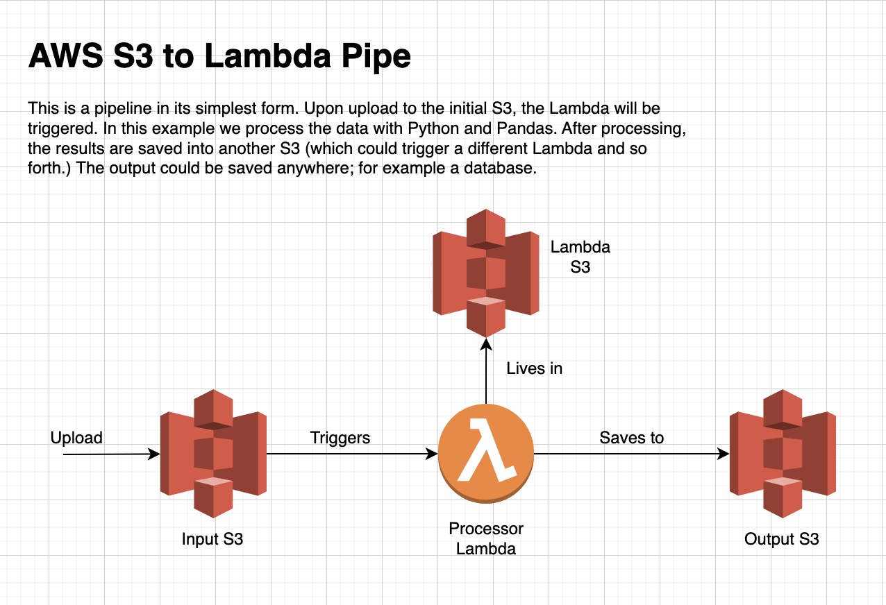

# S3 -> Lambda Pipeline

#### A simple event-driven pipeline that allows for processing on S3 files after upload

We are using Python+Pandas to do some basic data stuff.

## Quickstart
1. Pull down project
1. `docker-compose up`
1. In another tab run `docker cp s3-lambda-pipeline_etl_1:/code/ ./package`
1. `cd terraform` and `terraform init`
1. `terraform apply`

## Disclaimers
We use docker to compile our lambda because Pandas cannot be build/compiled on a Mac. The docker compose build the dependencies. We copy the files out of the container (sorry for the hack!)

1. The Dockerfile pulls down a Linux container with Pip.
1. In the container we install all the requirements from `requirements.txt`
1. We then copy everything out of the container with a command
1. Terraform zips up the dependencies and our code
1. Then Terraform deploys it to Lambda for it to execute it

If you can figure out a cleaner workaround, that would be nice. Ideally a single build command with Docker would be nice!

## Resources
- https://docs.aws.amazon.com/lambda/latest/dg/python-package.html#python-package-create-package-with-dependency
- https://spacelift.io/blog/terraform-aws-lambda#prerequisites
- https://note.nkmk.me/en/python-pip-install-requirements/